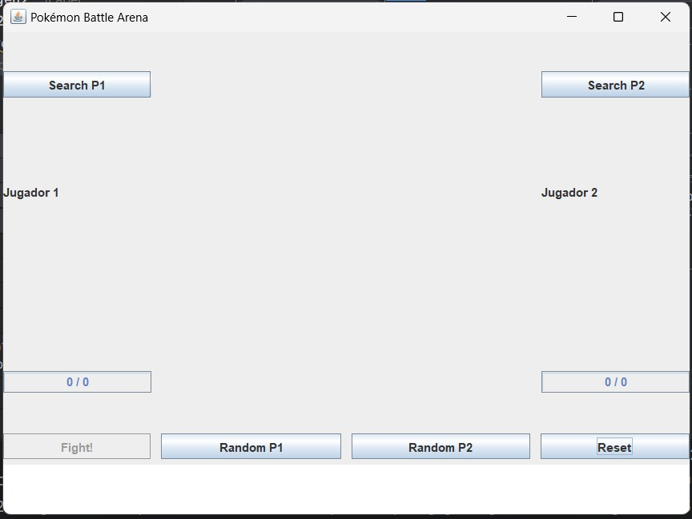
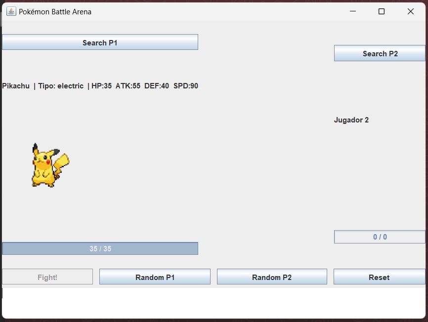
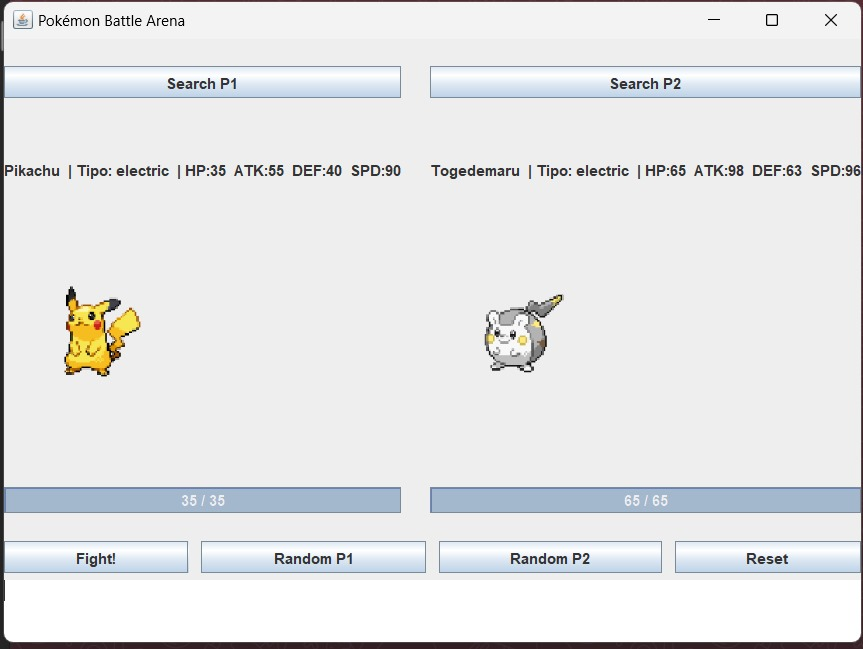
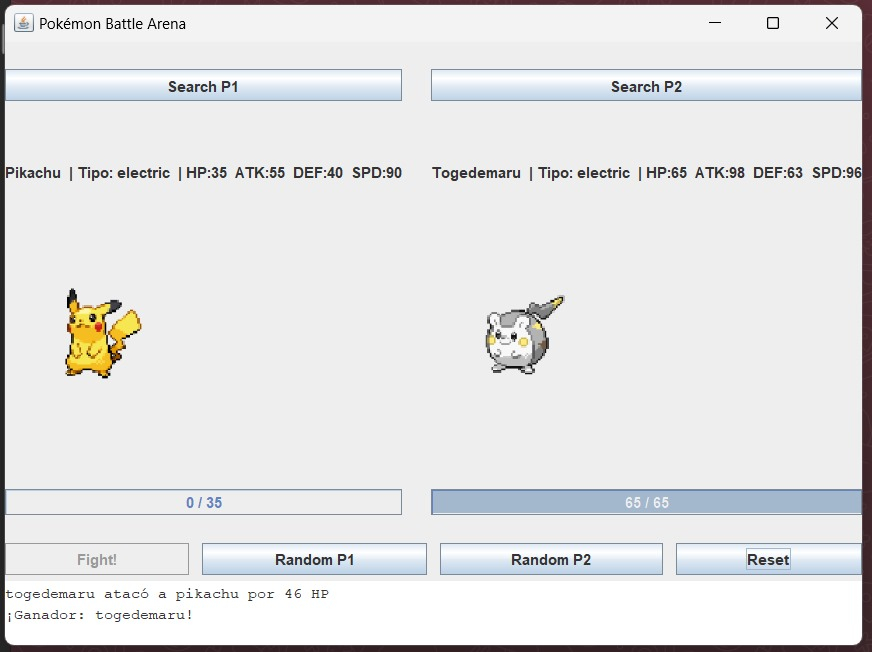

# Pokémon Battle Arena – Proyecto Java Swing

Este proyecto implementa una aplicación de escritorio en *Java Swing* que consume la **[PokeAPI](https://pokeapi.co/)** para simular batallas por turnos entre dos Pokémon.

## 🚀 Requisitos del sistema
- *Java 11+* (por uso de HttpClient)
- *IntelliJ IDEA* (recomendado, por el uso de .form del GUI Designer)
- Librería *org.json* (ya incluida en Maven/Gradle; ver abajo)

## 📦 Estructura de clases
- **Pokemon**: modelo con nombre, tipos, HP, Attack, Defense, Speed, sprite.
- **PokeApiClient**: cliente HTTP asíncrono para obtener Pokémon de la API (por nombre o aleatorio).
- **BattleEngine**: motor de combate con reglas de turno (orden por Speed, empate aleatorio), cálculo de daño (mínimo 1, crítico 10%, efectividad simple por tipo).
- **BattleListener**: interfaz para desacoplar lógica y UI (eventos de turno, cambio de HP, fin de batalla).
- **PokeApiGUI**: interfaz gráfica (Swing) con:
    - Botones: *Load P1/P2, **Random P1/P2, **Fight!, **Reset*
    - Vista de cada Pokémon: sprite, tipos, HP/ATK/DEF/Speed, barra de vida
    - Log de batalla (JTextArea con scroll automático)

## ⚔ Reglas de batalla
- El Pokémon con *mayor Speed* ataca primero.
- En caso de empate: atacante inicial aleatorio.
- Daño = función de ATK y DEF con factores aleatorios, mínimo 1.
- *10% de crítico* (x1.5).
- *Efectividad por tipo (opcional)*: Agua>Fuego, Fuego>Planta, Planta>Agua (x1.3), inversa x0.7.
- HP nunca baja de 0.

## 📑 Flujo de uso
1. *Seleccionar Pokémon*: por nombre (Load P1/P2) o aleatorio (Random P1/P2).
2. Cuando ambos estén cargados → el botón *Fight!* se habilita.
3. La batalla se desarrolla automáticamente, con logs en el área de texto.
4. Al terminar, se muestra el ganador y se pueden cargar nuevos Pokémon o resetear.

## ▶ Ejecución
### Opción 1 – Desde IntelliJ
1. Abre el proyecto.
2. Revisa que el .form de PokeApiGUI esté *bound* a org.LeetCode.PokeApiGUI.
3. Ejecuta PokeApiGUI.main() o Main.java (si configurado para lanzar la GUI).
4. ¡Disfruta la batalla!

